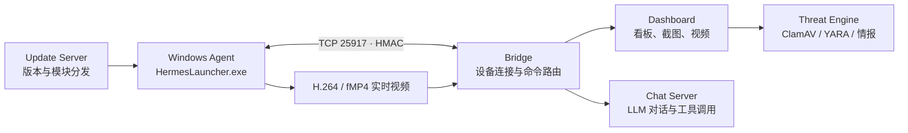

# Hermes GUI Agent

Hermes GUI Agent 是一套面向 **已授权 Windows 设备** 的远程运维与自动化系统。Windows 客户端通过带 HMAC 校验的长连接接入服务器；服务器提供设备看板、对话控制、截图、实时视频、模块更新和威胁扫描能力。

> 仅应部署在你拥有或获得明确授权管理的设备上。项目具备鼠标、键盘、命令和剪贴板等远程操作能力，请将访问控制、密钥管理和审计作为生产部署的前提。

## 能力概览

| 类别 | 能力 |
| --- | --- |
| 设备控制 | 截图、鼠标点击/拖动/移动、键盘输入、组合键、滚动、剪贴板和打开 URL |
| 运维执行 | 受控命令执行、文件下载及下载状态查询 |
| 实时画面 | Windows Desktop Duplication 抓屏、H.264/fMP4 传输、浏览器 MSE 播放 |
| 控制台 | 在线设备、服务健康、事件、截图、视频与威胁扫描看板 |
| 对话 | Chat Server 将对话请求转换为经过 Bridge 签名的设备动作 |
| 更新 | Windows 客户端按模块检查并下载 OTA 更新 |
| 威胁检测 | ClamAV、YARA、哈希/在线情报查询接口 |

## 架构



视频流由客户端编码后直接转发到看板；服务器不重新编码。当前默认以 GPU Desktop Duplication 抓取桌面，输出最高 1280 宽、20 FPS、0.25 秒 fMP4 分片，以降低浏览器端实时预览延迟。

## 项目结构

```text
hermes_gui_agent/
├── client/                 # Windows 客户端源码与打包脚本
│   ├── launcher.py         # EXE 启动器：从 modules/ 加载可热更新模块
│   ├── agent.py            # TCP 连接、HMAC、动作执行器
│   ├── unified.py          # Windows GUI / 托盘入口
│   ├── streamer.py         # H.264/fMP4 屏幕流
│   └── build_client.py     # PyInstaller 构建脚本
├── modules/                # 客户端可热更新模块
├── server/
│   ├── bridge.py           # TCP Bridge 与内部 HTTP API
│   ├── dashboard.py        # Web 看板与视频播放器
│   ├── chat_server.py      # 对话与工具调用服务
│   ├── update_server.py    # 更新文件与版本服务
│   └── threat_engine.py    # 威胁扫描服务
├── hermes/                 # 服务端共享配置、协议和流管理
├── scripts/                # systemd 服务示例
├── tests/                  # fMP4 分片与流管理测试
├── versions.json           # 更新服务版本信息
└── modules.json.example    # 模块清单模板（不含真实服务器地址）
```

## 端口与服务

| 服务 | 默认端口 | 用途 | 建议暴露方式 |
| --- | ---: | --- | --- |
| Bridge TCP | 25917 | Windows Agent 长连接 | 仅对受控客户端开放；生产环境建议 TLS 与防火墙白名单 |
| Bridge HTTP | 9123 | Bridge 内部状态、命令与视频流 | 仅绑定/暴露给服务器内部服务 |
| Update Server | 8890 | 客户端版本和模块下载 | 经反向代理并使用访问控制 |
| Chat Server | 8891 | 对话与工具调用 API | 经反向代理并使用 API Key |
| Dashboard | 8892 | 运维看板 | 经 HTTPS 反向代理公开 |
| Threat Engine | 8893 | 威胁扫描接口 | 建议仅内网访问 |

端口、服务地址、TLS 和限流配置由 `hermes/server_config.py` 从环境变量及 `~/.hermes/.env` 读取。

## 快速开始

### 1. 准备服务端

要求：Linux、Python 3.11+。威胁扫描功能还需要按需安装 ClamAV、YARA；Windows 视频编码所需的 FFmpeg 位于客户端侧。

```bash
git clone <YOUR_REPOSITORY_URL> hermes_gui_agent
cd hermes_gui_agent

python3 -m venv .venv
source .venv/bin/activate
pip install -r requirements.txt
```

创建 `~/.hermes/.env`，并限制其文件权限：

```bash
mkdir -p ~/.hermes
chmod 700 ~/.hermes
cat > ~/.hermes/.env <<'EOF'
# 每个值都应使用独立的高强度随机字符串；不要提交此文件。
SHARED_SECRET=replace_with_a_long_random_value
CHAT_API_KEY=replace_with_a_long_random_value
UPDATE_API_KEY=replace_with_a_long_random_value
DASHBOARD_API_KEY=replace_with_a_long_random_value
THREAT_API_KEY=replace_with_a_long_random_value

# 按你的 LLM 供应商填写。
LLM_API_KEY=replace_with_provider_key
LLM_BASE_URL=https://your-provider.example/v1
LLM_MODEL=your-model-name

PUBLIC_IP=your-public-hostname-or-ip
PUBLIC_PORT=443
PUBLIC_SCHEME=https

# 生产环境建议开启，并配置有效证书。
TLS_ENABLED=1
TLS_CERT_FILE=/path/to/server.crt
TLS_KEY_FILE=/path/to/server.key
TLS_CA_FILE=/path/to/ca.crt
EOF
chmod 600 ~/.hermes/.env
```

在开发或排障时，可分别启动服务：

```bash
export PYTHONPATH="$PWD"
python server/bridge.py
python server/dashboard.py
python server/chat_server.py
python server/update_server.py
python server/threat_engine.py
```

生产环境应使用 systemd 管理进程。`scripts/hermes-bridge.service` 提供 Bridge 示例；复制后请根据实际部署路径修改 `WorkingDirectory`、`ExecStart`、`User` 和 `EnvironmentFile`，其余服务可采用同样模式。建议通过 Nginx/Caddy 提供 Dashboard、Chat 和 Update 的 HTTPS 入口。

### 2. 构建 Windows 客户端

要求：Windows、Python 3.11+（含 tkinter）、PyInstaller、Pillow。客户端需要一个**不纳入 Git** 的 `client/_enc_config.py`，其中保存加密后的服务器地址与共享密钥配置。

```powershell
cd client
python build_client.py
```

也可以运行 `client/build.bat`。构建成功后，产物位于：

```text
dist/
├── HermesLauncher.exe
└── modules/
```

将整个 `dist/` 目录复制到目标 Windows 主机后运行 `HermesLauncher.exe`。首次接入后，客户端会向 Bridge 报告设备名、设备 ID 和支持的能力。

> `build_client.py` 会重建仓库根目录的 `dist/`。如需保留已有发布包，请先复制或备份该目录。

## 实时视频

看板选择设备后会向 Agent 下发 `stream_start`，客户端通过 FFmpeg 完成：

1. `ddagrab` / Desktop Duplication 抓取 Windows 桌面；
2. `libx264` 编码为 H.264；
3. 使用 fMP4 初始化段和媒体分片通过 Bridge 转发；
4. Dashboard 使用 MediaSource Extensions（MSE）顺序追加分片并追随直播边缘。

默认目标为 20 FPS，最大宽度 1280，分片长度约 0.25 秒。实际延迟会受到网络、浏览器、GPU 与桌面分辨率影响；正常情况下应为约 1 秒级，而不是多秒历史回放。

### 视频排障

| 现象 | 检查项 |
| --- | --- |
| 看板没有画面 | 确认 Agent 在线、Windows 客户端存在 `ffmpeg.exe` 或可用 FFmpeg、浏览器支持 MSE |
| `init segment` 错误 | 重新启动视频流，让客户端发送新的 fMP4 初始化段 |
| `sourceBuffer` 错误或画面停住 | 刷新看板（`Ctrl + F5`）并重新打开视频；确认客户端与服务器的 `streamer.py` 版本一致 |
| 显示 2–3 FPS | 那是分片频率而非帧率；看板现按 fMP4 样本数计算实际 FPS |
| 延迟偏高 | 确认使用当前 0.25 秒分片版本；避免在浏览器后台运行；检查网络与 CPU/GPU 占用 |

## 安全基线

- 不要提交 `~/.hermes/.env`、`client/_enc_config.py`、SSH 私钥、证书、下载的密钥文件或生产日志。
- 所有 Bridge 管理动作使用 `SHARED_SECRET` 进行 HMAC-SHA256 签名；Dashboard、Chat、Update 和 Threat 服务应使用各自的 API Key。
- 将 Bridge HTTP、Threat Engine 等内部端口限制在本机或私网；仅将必要的 HTTPS 入口暴露到公网。
- 对 Windows Agent 仅部署到受授权设备，并对命令、下载和剪贴板等高权限能力保留审计记录。
- 部署 TLS 时应使用可信证书与 CA，避免在互联网环境中使用明文 TCP。

仓库已忽略常见的私钥、证书、临时下载文件、构建产物、日志和本地加密配置。提交前仍建议执行：

```bash
git status --short
git diff --cached --check
```

## 测试

当前测试覆盖 fMP4 分片完整性和服务器端流会话：

```bash
python -m unittest tests/test_streamer_segments.py tests/test_stream_manager.py
```

## 开发约定

- `client/streamer.py` 与 `modules/streamer.py` 需要保持一致：前者用于构建，后者用于热更新。
- `modules.json` 是生产模块清单，含服务器地址，因此不纳入版本库；使用 `modules.json.example` 作为模板。
- 修改视频协议时，应同时验证客户端分片、`hermes/stream_manager.py`、`server/bridge.py` 与 Dashboard MSE 播放逻辑。
- `docs/planner-chat-integration.md` 是 Planner 与 Chat 集成方案，尚不代表已上线功能。

## 反馈

请通过 [GitHub Issues](../../issues) 提交问题、复现步骤和脱敏日志。涉及密钥、设备信息或安全问题时，请不要直接发布敏感内容。
